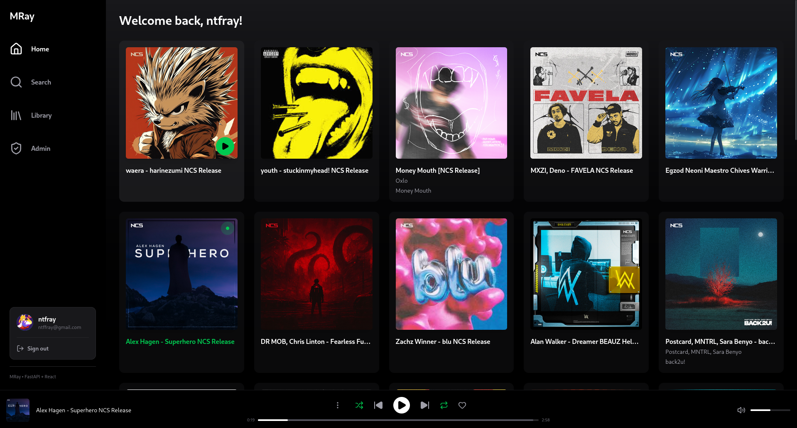
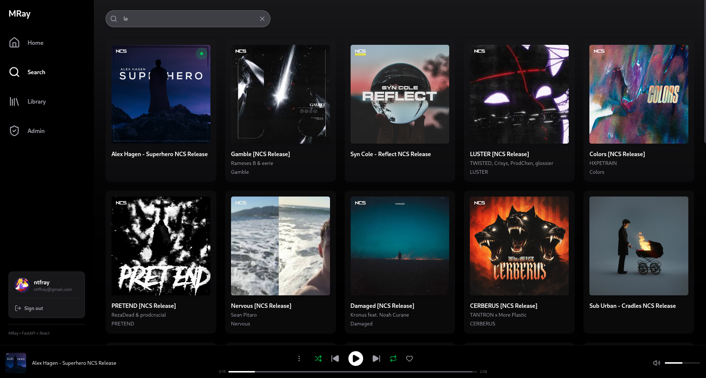
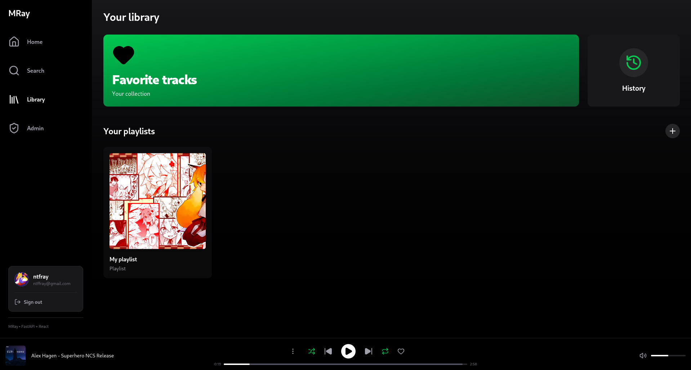
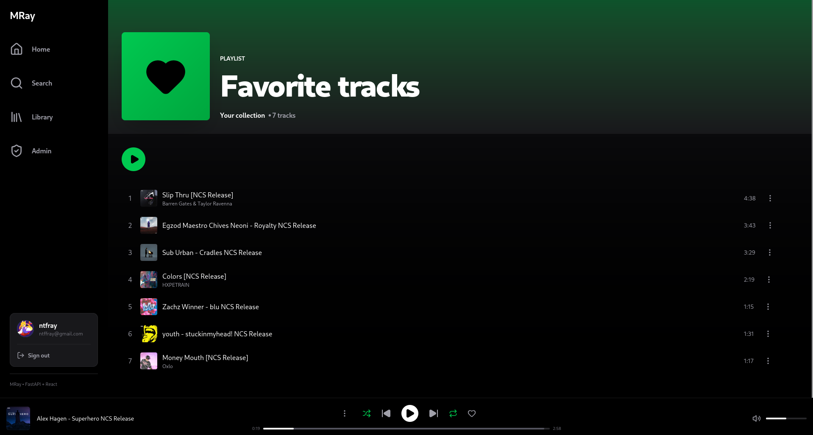
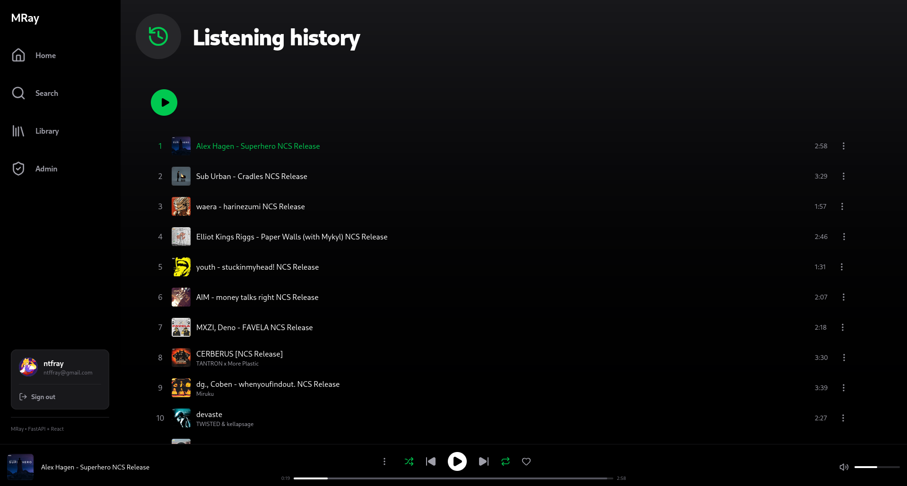
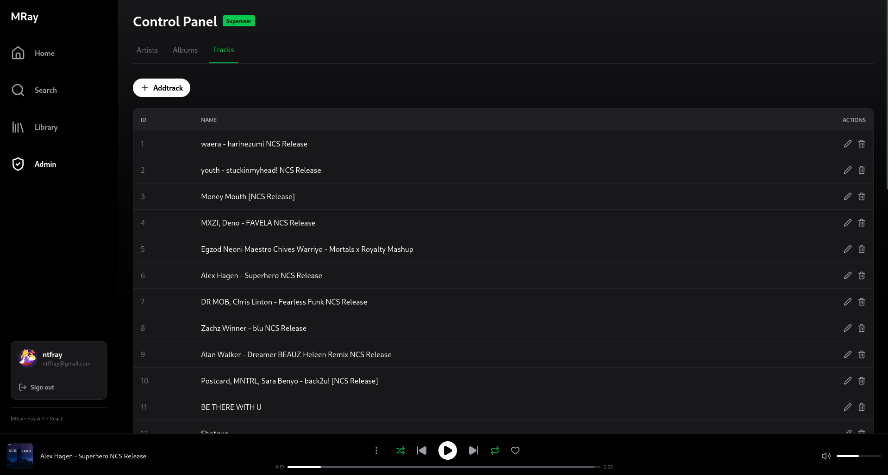
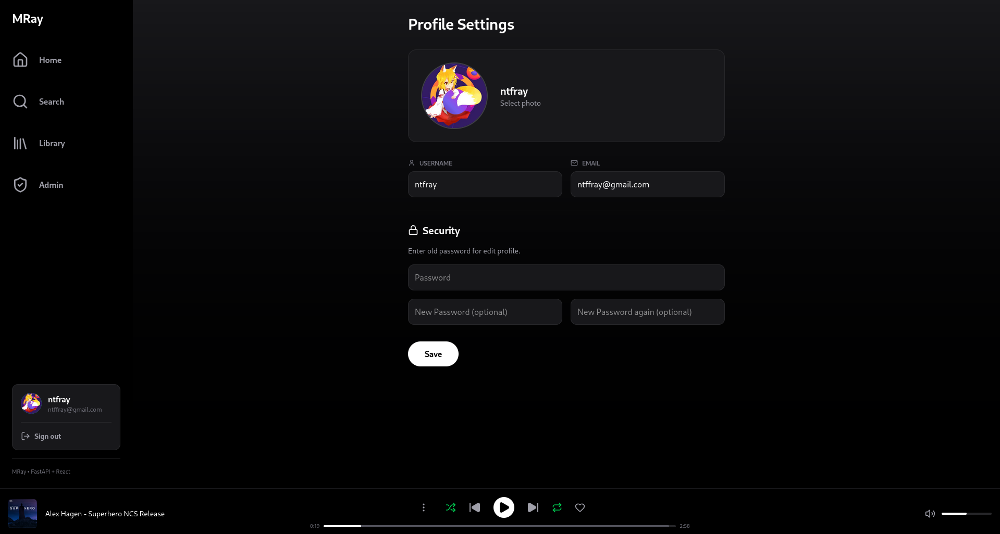
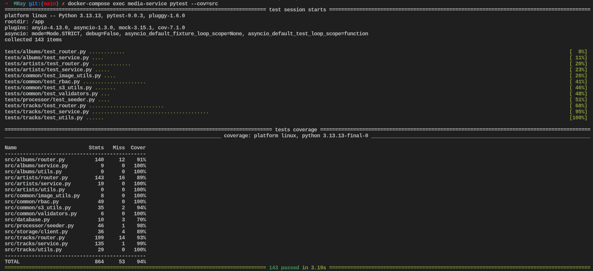
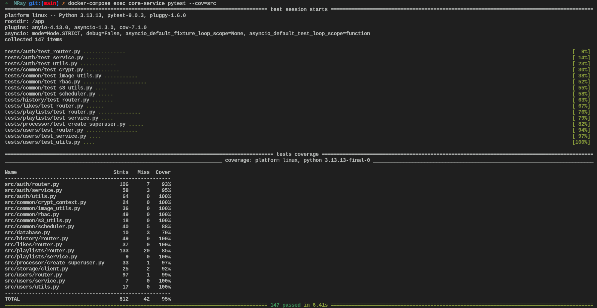

 <strong style="font-size: 20px; vertical-align: middle;">MRay</strong>

**🔗 [Live demo](https://mray-music-app.netlify.app)**

<div align="center">  
  
  
  <div style="display: flex; gap: 10px; justify-content: center; margin-bottom: 10px;">
    
    
  </div>
  
  <div style="display: flex; gap: 10px; justify-content: center; margin-bottom: 10px;">
    
    
  </div>
  
  <div style="display: flex; gap: 10px; justify-content: center;">
    
    
  </div>
</div>

A high-performance, full-stack music streaming platform built with a **Microservices Architecture**. This project demonstrates modern software engineering practices, including asynchronous processing, cloud storage integration, and industry-standard security implementation. **MRay** is designed with scalability in mind, separating heavy I/O operations (streaming) from core business logic to ensure high availability and independent scaling of services.

[**Swagger UI (Core Service)**](https://mray-music-app.onrender.com/docs)

[**Swagger UI (Media Service)**](https://mray-music-app-1.onrender.com/docs)

# 🏗 Architecture Overview

The system is split into two independent microservices communicating over a shared network, using a **Database-per-Service** pattern to ensure isolation and scalability.

- **Media Service**: Handles high-bandwidth tasks. Responsible for **audio streaming** (chunked data), metadata extraction (`ID3 tags`), and managing tracks, artists, and albums.

- **Core Service**: Handles business logic. Manages user authentication (`JWT`), profiles, social interactions (likes), track history, and custom playlists.

- **S3 Storage (Supabase/MinIO)**: Cloud-native storage for media files and assets.

- **PostgreSQL**: Two independent databases for relational data with optimized search using `GIN Trigram` indices.

# 🚀 Key Features
## 🎸 Streaming & Media

- **Partial Content Streaming**: Implemented HTTP 206 "Range Requests" for efficient audio streaming and instant seeking (rewinding).

- **Smart Metadata Extraction**: Automated ID3 tag parsing using `Mutagen` to populate the database from uploaded MP3 files.

- **Adaptive Search**: Advanced search ranking using **GIN Trigram Indices** and similarity scoring (Levenshtein distance) in PostgreSQL.

- **S3 Integration**: Seamless integration with S3-compatible APIs for secure media handling.

## 🔐 Security & Auth

- **Refresh Token Rotation**: Enhanced security against token theft by invalidating all sessions upon detecting compromised refresh tokens.

- **RBAC (Role-Based Access Control)**: Granular permissions separating regular listeners from Superusers (Admins).

- **Password Security**: Argon2-compliant hashing via `Bcrypt` with pre-hashing logic to bypass the 72-byte limit.

- **Stateless Verification**: Media service validates identity using shared JWT secrets, minimizing cross-service latency.

## 💻 Modern Frontend

- **Global State Management**: Powered by `Zustand` for a persistent, gapless playback experience during navigation.

- **Spotify-inspired UI**: Fully responsive design built with `React 19`, `TypeScript`, and `Tailwind CSS v4`.

- **Media Session API**: Integration with hardware media keys and Bluetooth devices.

# 🛠 Tech Stack

**Backend:**

- Framework: **FastAPI** (Asynchronous)

- ORM: **SQLAlchemy 2.0** (Async mode)

- Migrations: **Alembic**

- Validation: **Pydantic v2**

- Media Logic: **Mutagen, aioboto3**

**Frontend:**

- Library: **React 19 + Vite**

- Language: **TypeScript**

- State: **Zustand**

- Icons: **Lucide React**

- Styling: **Tailwind CSS v4**

**Infrastructure:**

- **Docker & Docker Compose**

- **PostgreSQL** (with `pg_trgm` extension)

- **Supabase/MinIO** (S3 Storage)

- **Neon** (Serverless Postgres)

# 🔧 Local Development Setup
**Prerequisites**

- Docker & Docker Compose

- Node.js (v20+)

**1. Clone the repository**

```Bash
git clone https://github.com/NikolayRom/MRay-Music-App.git
cd MRay
```

**2. Environment Variables**

Create a `.env` file in the root directory:

```Env
MINIO_URL=http://minio:9000
MINIO_POLICY_URL=http://minio:9000
MINIO_ROOT_USER={your_name}
MINIO_ROOT_PASSWORD={your_password}
MINIO_MAX_FILE_SIZE=52428800

MINIO_BUCKET_NAME=ncs-music
MINIO_BUCKET_NAME_MEDIA_ASSETS=media-assets
MINIO_BUCKET_NAME_CORE=core-assets

POSTGRES_USER={your_name}
POSTGRES_PASSWORD={your_password}
POSTGRES_HOST=postgres
POSTGRES_PORT=5432
MAX_GET_SIZE=1000
DEFAULT_GET_SIZE=100

POSTGRES_DB_MEDIA=media
POSTGRES_URL_MEDIA=postgresql+asyncpg://${POSTGRES_USER}:${POSTGRES_PASSWORD}@${POSTGRES_HOST}:${POSTGRES_PORT}/${POSTGRES_DB_MEDIA}

POSTGRES_DB_CORE=core_db
POSTGRES_URL_CORE=postgresql+asyncpg://${POSTGRES_USER}:${POSTGRES_PASSWORD}@${POSTGRES_HOST}:${POSTGRES_PORT}/${POSTGRES_DB_CORE}

JWT_SECRET_KEY={your_secret_key}
JWT_ALGORITHM=HS256
JWT_ACCESS_TOKEN_EXPIRE_MINUTES=30
JWT_REFRESH_TOKEN_EXPIRE_DAYS=7
JWT_RESET_TOKEN_EXPIRE_MINUTES=15
INACTIVE_REFRESH_TOKEN_LIFETIME_DAYS=7
JWT_MAX_SESSIONS=3

SUPERUSER_USERNAME={superuser_name}
SUPERUSER_EMAIL={superuser_email}
SUPERUSER_PASSWORD={superuser_password}
SUPERUSER_AUTO_CREATE=True

USER_HISTORY_LIFETIME_DAYS=7

SMTP_HOST=smtp.gmail.com
SMTP_PORT=465
SMTP_USER={smtp_email}
SMTP_PASSWORD={smtp_password}
```

Also a `.env` file in the frontend directory:

```Env
VITE_CORE_API_URL=http://127.0.0.1:8081
VITE_MEDIA_API_URL=http://127.0.0.1:8000
VITE_S3_PUBLIC_URL=http://localhost:9000
```

**3. Launch the Services**

```Bash
docker-compose up -d --build
```

The application will be available at:

- **Frontend**: `http://localhost:5173`

- **Media API (Docs)**: `http://localhost:8000/docs`

- **Core API (Docs)**: `http://localhost:8081/docs`

# 🧪 Testing & Quality

The project maintains high standards of reliability with **>94% test coverage** for media-service and **>95% test coverage** for core-service using `Pytest` and `Httpx`.

 

```Bash
# Run tests for Media Service
cd media-service
docker-compose exec media-service pytest --cov=src

# Run tests for Core Service
cd core-service
docker-compose exec core-service pytest --cov=src
```

# 📈 Future Roadmap

- [ ] Real-time lyrics synchronization.

- [ ] Artist verification system.

- [ ] Recommendation engine based on user history.

- [ ] Desktop wrapper using Electron.

# 👨‍💻 Author

**Nikolay Romanov:**

- [LinkedIn](https://www.linkedin.com/in/nikolay-romanov-6202a0412)

- [GitHub](https://github.com/NikolayRom)

- [Telegram](https://t.me/ntfray)